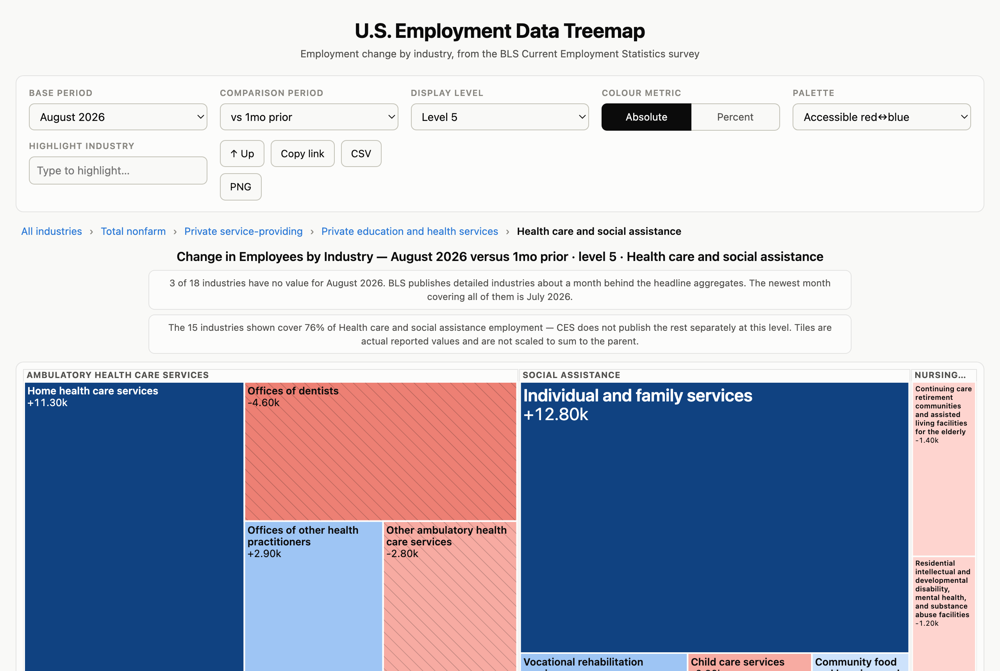
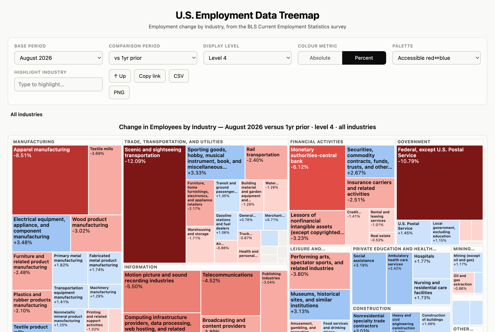

# Nonfarm Payrolls by Industry: Free Interactive Treemap

Every month the Bureau of Labor Statistics publishes one employment number that leads the news, and roughly 850 more that almost nobody sees. The headline is total nonfarm payrolls. Underneath it sits the entire industry hierarchy of the BLS employer survey, called the CES, running down to six-digit detail like underground coal mining and offices of dentists. This treemap shows all of it at once: every published industry, each one sized by the jobs it actually added or lost. Click any tile to drill into the industries inside it, set the base month to any month on record, and switch the comparison from one month to as long as twenty years.

<iframe src="https://data4thepeople.github.io/NFP_Treemap/dist/index.html" title="Interactive treemap of US nonfarm payroll employment change by industry" width="100%" height="780" style="border:0" loading="lazy"></iframe>

## What you are looking at

The chart is a treemap, which shows quantity as area. Each rectangle is one industry that the BLS publishes separately.

Size is the number of jobs. A tile's area is the absolute change in employees over the period you picked, so the industries that moved the labor market most are the biggest shapes on the screen. That stays true in both color modes, deliberately. Sizing by percent would let a three-thousand-person industry with a good month outweigh food services.

Color is direction and scale. Blue is a gain, red is a loss, and the scale is symmetric around zero, so a loss and a gain of equal size read at equal strength. We computed the palette rather than picking it, and validated it against the standard color-vision-deficiency transforms, so the two directions stay apart for readers who cannot separate them by hue.

Grouping is the hierarchy itself. Tiles are grouped into their supersector, or into the direct children of whatever you drilled into. Those labeled bands are the level of the tree you are standing on.

Nothing here is scaled, padded or balanced to make the arithmetic look tidy. Every tile is the number BLS reported.

## Why the headline number hides so much

The monthly payroll figure is an aggregate of an economy that is not moving in one direction. In a typical month some industries hire hard while others shed staff, and the headline is the arithmetic left over. Two months with an identical total can be completely different events underneath.

We have written about one version of this before. In [Giants Walk Among Us](https://www.data4thepeople.com/p/giants-walk-among-us/) we found that nearly nine in ten new American jobs since 2024 came from a single place: health care and social assistance. That finding came out of this same survey. It is the kind of thing that is invisible in the headline and obvious the moment you can see every industry side by side.

This is not a criticism of the headline. It is why BLS publishes the detail at all. The problem has always been reaching it. The detail exists as hundreds of separate time series behind a query interface built for people who already know the series identifier they want. If you want to know how software publishers or nursing homes or heavy civil engineering construction are doing, the data has been public the entire time and effectively out of reach.

A treemap answers one question well. Of everything that moved this period, what moved most, and in which direction? You do not need to know what you are looking for before you look. The biggest shapes are the biggest movers, so the story finds you, and then you click into it.

*Drill into a sector and you get its published sub-industries, a breadcrumb trail back up, and a plain statement of how much of the parent those children actually cover.*

## What you can do with it

Click a tile to descend into that industry's own children. The breadcrumb above the chart shows where you are and every step in it is clickable. The Up button and the Escape key both go up one level, and if you navigate by keyboard you can Tab between tiles and press Enter to drill in.

The display level controls how fine the breakdown is. Level 2 is the eleven supersectors. Level 3 is nineteen sectors, and it is where the page opens, because every industry at that level publishes with the headline. Levels 4 through 7 go progressively finer, ending in 166 six-digit industries.

The base period is any month in the record and the comparison period is the horizon: one month, or one, two, three, five, ten or twenty years. One month is the jobs report. The longer horizons are where structural change separates from noise, which is why we carry history back to 1939 rather than to the last business cycle. Setting the base month is what turns this into a historical instrument. You can ask what the labor market looked like in March 2007 and what was moving then, not only what is moving now.

Switch the color metric to Percent for proportional change instead of absolute. A small industry losing a tenth of its workforce is a real event that the absolute view draws as a sliver. Tile area stays absolute in both modes, so you see size and rate at the same time.

Hover any tile for the employment level, the change over your horizon, the official NAICS definition of that industry, and an anomaly score. Type in the highlight box to find an industry by name instead of hunting for it. CSV downloads the view you are looking at, PNG saves the chart as an image, and Copy link writes the whole state into the URL, so a specific industry at a specific level over a specific horizon is a link you can send or cite.

*The percent view over one year. Tile area is still the absolute job change, so a big industry moving slightly and a small industry moving sharply are both legible.*

## What the anomaly score is for

A change of 8,000 jobs means nothing on its own. It is enormous for an industry that normally moves by a few hundred and unremarkable for one that routinely swings by tens of thousands.

The anomaly score answers the question the raw number cannot. Is this unusual for this industry? It compares the change on screen against that same industry's own history of changes over the same length of time, and reports a robust z-score, a percentile rank and a plain-language label. The tooltip tells you the span of history it actually covered, which is not always the span it wanted.

It is willing to say it does not know. Where an industry lacks enough independent history for the horizon you chose, it reports insufficient history instead of a confident wrong number. Getting that comparison right was the hardest part of building this, and it is worth explaining what went wrong first.

## How we built it

### Every number comes from the BLS API

We pull the monthly values directly from the BLS Public Data API rather than the flat text files, which means the whole thing refreshes in seventeen requests when a jobs report lands. Twenty-six series reach back to January 1939. Most industry detail begins in 1990, which is when CES started publishing it separately.

Two things the API cannot give us are fetched once and cached. The `ce.industry` reference file carries each industry's display level, sort order and NAICS code, and the API has no metadata endpoint to serve them. The Census NAICS descriptions supply the definition text you see on hover.

### The hierarchy is derived from the codes, not read off the file

This is the part that looks solved and is not. The obvious rule is that an industry's parent is the nearest preceding row with a smaller display level. It reports zero orphans, which is exactly what makes it dangerous. It is quietly wrong.

CES interleaves its residential and nonresidential part-splits at the same level as the total those parts split. Under the obvious rule, all fifty-two specialty trade contractor rows attach to nonresidential specialty trade contractors instead of to specialty trade contractors. Every one of them lands under the wrong parent and nothing complains.

So we derive parents from the industry code instead, walking trailing digits off until a published ancestor appears. The aggregates above the supersectors get an explicit map, because their relationships are encoded nowhere and are not a tree. Total nonfarm is total private plus government, and also goods-producing plus service-providing, while private service-providing sits inside both total private and service-providing. That shape is a lattice. We state it rather than infer it.

### NAICS codes are written in five undocumented syntaxes

The NAICS field in the BLS reference file is not a code. It is a compressed notation with at least five forms: a plain code, comma shorthand where `21221,3,9` means three separate industries, semicolon groups, numeric ranges, and "part" qualifiers.

The rule that makes them resolve is not obvious. Each fragment replaces the trailing digits of the previous code in the list, not of the first one. Expand against the base instead and `332200;991,9` resolves to `332209` when the right answer is `332999`. All 813 non-aggregate industries resolve, which is what puts an official definition on every tile that has one.

### Three roll-ups double-count their own siblings

Some CES roll-ups sit at the same display level as the components they are made of. Health care, at level 4, is exactly ambulatory plus hospitals plus nursing, and all four are published at level 4. A flat view of that level counts those jobs twice. In the month we caught this, the children of health care and social assistance summed to 61,300 against a true 41,000.

Three rows do it: health care, specialty trade contractors, and motor vehicles and parts. We find them structurally, by detecting a row whose NAICS set is exactly the union of its same-level siblings, rather than hard-coding three names that would rot silently the next time BLS revises the hierarchy. They are hidden by default and you can switch them on.

### Levels are not partitions, and we do not pad them

CES publishes only some children for many parents. The tiles at a level frequently do not sum to the parent above them, and we do not scale or pad anything to make them.

That is deliberate, because the alternative is worse. Forcing a sum means inventing a residual category and putting a number in it that BLS never published. Instead every tile is the reported value, and where the shortfall matters the page says so: drill into a parent whose published children cover three quarters of it and you are told it is three quarters. The top level carries the opposite warning, because those four aggregates overlap and sum to more than the total.

### The anomaly sample has to scale with the horizon

Our first version used a fixed 120-month lookback. That holds 120 independent one-month changes but only about three independent three-year windows, so at long horizons the score was driven by whatever single episode all the overlapping windows happened to share.

It produced a confident absurdity. Total nonfarm's three-year change scored −3.66, "extreme", 0th percentile, on a gain of 2.81 million jobs. All seventy-nine comparison windows had been measured off the 2020 trough, so every one of them was an enormous gain, and an ordinary large gain looked catastrophic beside them.

Four things fix it.

The lookback scales with the horizon, at ten months of history per month of comparison, with a twenty-year floor. That floor is not padding. A ten-year window with the pandemic removed contains no downturn at all, so every sample in it is an expansion-year change, and an ordinary year of +403,000 for total nonfarm scored −4.05, "extreme". At twenty years the sample reaches back through 2008 and the same year reads −2.31, "unusual".

Overlapping windows are not independent, so we require at least six non-overlapping ones. Below that the tool reports insufficient history rather than a number.

The pandemic distortion is excluded, from March 2020 to June 2022, which is the collapse through to payrolls regaining their February 2020 peak. A window is dropped if either endpoint falls inside it. Excluding only the acute months left three-year windows still starting from deep in the hole.

The z-score is robust, built on the median and the median absolute deviation rather than the mean and standard deviation, which a handful of pandemic-scale outliers otherwise dominate.

### Revisions overwrite, because a jobs number is a moving target

CES revises the two preceding months at every release, and up to five years of seasonally adjusted history at each annual benchmark. Our refresh upserts on industry and month, so a revision replaces the cached value instead of accumulating beside it.

This surprises people, so it is worth stating plainly. The number you saw last month may not be the number you see now, and that is the data behaving correctly. One food services month read −32,900 in the vintage we captured at the time and −12,100 in the next. Same series, same month, different vintage.

### The detail lags the headline, and the page says so

CES publishes most industry detail about a month behind the headline aggregates. On the morning a jobs report lands, roughly a fifth of the 842 series carry the new month.

The tool opens on the newest month at level 3, because all nineteen industries at that level publish with the headline, so the opening view is complete. Go deeper on release day and some tiles have no value yet. The page counts them and names the most recent month that covers all of them, rather than hiding the gap or quietly falling back to an older month while you assume you are seeing the latest.

It also separates the two reasons a tile can be empty, because blaming the wrong one is worse than saying nothing. At the newest month, the detail is not published yet. In 1955, most of these industries did not exist as published series, because CES industry detail begins in 1990.

### It is a single file

The whole visualization is one self-contained HTML file. No server, no external requests, no build step when it loads. The browser receives raw monthly levels only and computes every change, percentage and anomaly score on demand, because precomputing them was never viable: every combination of base period, horizon and display level would dwarf the underlying data and still would not cover click-to-drill. The levels ship delta-encoded, which roughly halves the payload.

That is why the chart can be embedded anywhere, exported, and read offline.

## What this data cannot tell you

It counts payroll jobs, not people. CES asks employers how many people are on their payrolls, so somebody with two jobs is counted twice and the self-employed are not counted at all. The unemployment rate comes from the household survey, called the CPS, which is a different survey with a different frame. We built [a separate tool](https://www.data4thepeople.com/p/beyond-the-unemployment-rate/) for that one.

It is national. CES publishes state and metropolitan detail, and this visualization does not use it.

It is seasonally adjusted throughout, which is the right basis for comparing one month to the next and the wrong basis for asking how many people worked in retail in December.

It does not forecast, and it will not tell you why an industry moved. It tells you what moved, by how much, how unusual that is for that industry, and exactly what the industry contains.

## Frequently asked questions

### What is the Current Employment Statistics survey?

The Current Employment Statistics survey, also called the establishment survey or the payroll survey, is a monthly US Bureau of Labor Statistics survey of roughly 121,000 businesses and government agencies. It produces the headline nonfarm payrolls figure reported each month, along with employment, hours and earnings for every industry it publishes. Because it surveys employers rather than households, it counts filled jobs rather than employed people.

### Which industries added the most jobs last month?

That changes every month, which is what this treemap is for. Open it on the most recent month with a one-month comparison and the largest blue tiles are the industries that added the most jobs, while the largest red tiles are the ones that lost the most. Click any tile to see which specific sub-industries inside it drove the change.

### How often is this data updated?

BLS releases the Employment Situation report monthly, usually on the first Friday of the month, covering the previous month. We refresh this visualization from the BLS API after each release. Because CES revises the two preceding months at every release, and up to five years of seasonally adjusted history at each annual benchmark, a refresh also updates months that were already published.

### How far back does BLS payroll data go?

To January 1939 for the broadest aggregates, including total nonfarm payrolls. Most individual industries begin in January 1990, when CES started publishing that level of detail separately. This tool shows each series over the span it actually exists, and it distinguishes a gap caused by an industry not yet being broken out from a gap caused by data not yet being released.

### Why do the industries not add up to the total?

Because BLS publishes only some children for many parent industries. The published sub-industries of a parent frequently cover less than all of it, and the remainder is not published separately. Nothing here is scaled or padded to force a sum, so where the published children cover 76% of a parent, the page tells you it is 76% rather than inventing a residual category to close the gap.

### What is a treemap, and why use one for employment data?

A treemap displays quantity as area, using nested rectangles to represent a hierarchy. It suits payroll data because employment change is both hierarchical and extremely unequal, with a handful of industries accounting for most of the movement in any month. A treemap makes the largest movers the largest shapes, so the significant changes are visible without knowing in advance what to look for, and the nesting lets you click from a sector straight into the specific industry beneath it.

### Is this payroll data visualization free?

Yes. There is no account, no paywall and no usage limit, and it can be embedded in another website with a standard iframe. The underlying data is public-domain US government statistics that anyone can obtain from BLS directly.

### Can I download the data as CSV?

Yes. The CSV button downloads whatever view you are currently looking at, including any industry you have drilled into, with the same values shown on the tiles. The PNG button exports the chart as an image.

### What does the anomaly score mean?

It compares the change you are looking at against the same industry's own history of changes over the same length of time, and reports how unusual it is as a robust z-score, a percentile and a plain-language label. It uses at least twenty years of history, requires at least six non-overlapping comparison windows before it will report anything, and excludes March 2020 through June 2022 so that the pandemic collapse and recovery do not define what counts as normal for an industry.

### What is the difference between the payroll survey and the household survey?

They are two separate monthly surveys. The payroll or establishment survey, the CES, shown here, asks employers how many people are on their payrolls and produces the nonfarm payrolls figure and all the industry detail. The household survey, the CPS, asks people about their own employment status and produces the unemployment rate. They regularly disagree in a given month because they measure different things by different methods.

### What does seasonally adjusted employment mean?

Seasonal adjustment removes the regular within-year pattern that repeats every year, such as retail hiring before the winter holidays or construction slowing in winter. It is what makes one month comparable to the month before it. Every figure in this visualization is seasonally adjusted, which is the correct basis for measuring change and the wrong basis for asking how many people held a particular job in a particular month.

### Can I embed this visualization on my own site?

Yes. It is a single self-contained page built to be framed. It detects that it is embedded, switches to a compact layout that fits a fixed-height iframe without scrolling, and posts its content height to the parent for hosts that want to size the frame automatically. Every control lives in the URL fragment, so you can embed a specific industry, level and horizon directly.

## The code behind this chart

The full pipeline is public, including the fetch, the hierarchy derivation, the NAICS parser, the anomaly scoring and the test suite that covers them: [github.com/Data4ThePeople/NFP_Treemap](https://github.com/Data4ThePeople/NFP_Treemap).

## Sources

- [US Bureau of Labor Statistics, Current Employment Statistics](https://www.bls.gov/ces/). All employees, seasonally adjusted, in thousands, retrieved through the BLS Public Data API v2. 842 series, 401,515 monthly observations, January 1939 through the current release.
- [BLS Employment Situation news release](https://www.bls.gov/news.release/empsit.toc.htm), the monthly release this visualization tracks.
- BLS `ce.industry` reference file, for the industry hierarchy, display levels and NAICS mappings.
- [US Census Bureau, 2022 NAICS Descriptions](https://www.census.gov/naics/), for the official industry definitions shown on hover.

Every figure in this visualization is the value BLS published. Nothing is modelled, interpolated, smoothed or rescaled.
