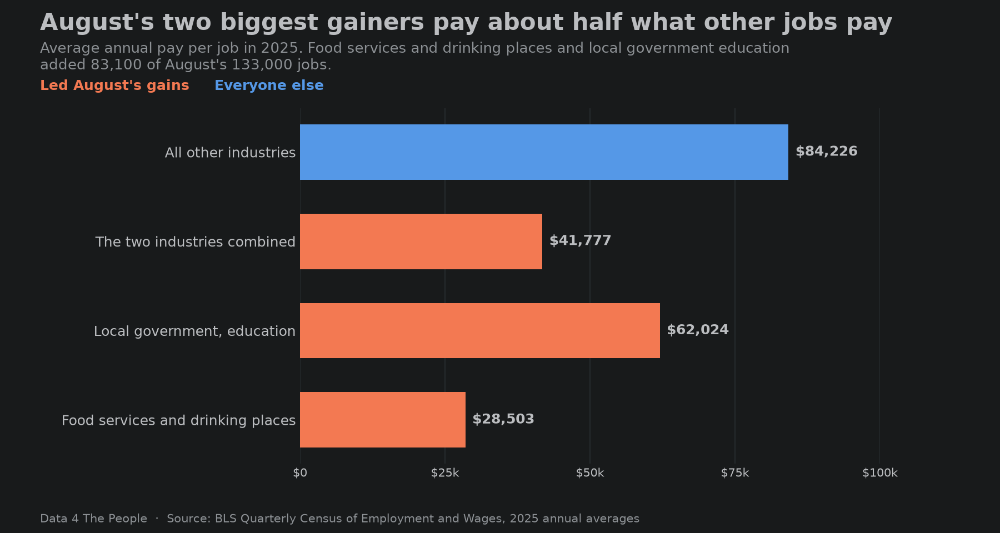

# How to Analyze U.S. Jobs Data

Last Friday, the Bureau of Labor Statistics released data showing the U.S. added 29,000 jobs in September. They also released footnotes telling us that if they were to replicate this survey 10 times, about nine of them would land somewhere between -93,000 and 151,000, and about one would land outside that band.

*Source: BLS Current Employment Statistics, seasonally adjusted, as of October 2, 2026. The plus or minus 122,000 range is from the BLS technical note.*

So, why do so many people care about this one number? They shouldn’t. It says very little about how many jobs the U.S. actually added in September. But people care, because enough other people care. We’ve said this many times, but if enough people believe something is true, then others will act like it is true, even if they know it is not.

In three words: perception is reality.

But we can’t lose grasp of what’s actually true. If we do, we have no foundation to build much of anything on (debate, problem solving, policy, advancement, etc.). This is the entire reason for being for D4TP. One day, hopefully soon, you will have tools right here on this website that will let you explore and experience truth directly from raw public data – just as we do five times a week.

## Where the jobs data is still useful

So, is the nonfarm payroll data completely useless? Not at all. When we move past the latest month’s data and look towards longer term trends (which are based on revised data rather than noisy initial estimates), it’s a much more helpful gauge of the U.S. job market.

Today, we’re going to investigate a few of the findings from prior months' data that caught our attention.

## Our first video tutorial

But before we do, we’re super excited to announce that we finally figured out how to systematically create tutorial videos for our data visualizations. Here’s a quick 45 second video for the nonfarm payroll data treemap visualization. Make sure to bookmark and subscribe to our new YouTube page to get alerts when we drop new visualization tutorials.

<iframe src="https://www.youtube.com/embed/Pk_GuM4U0c4?si=CXEwns1HKCjaIJsA" title="How to Use the U.S. Jobs Data Explorer" width="100%" height="495" style="border:0" allow="accelerometer; autoplay; clipboard-write; encrypted-media; gyroscope; picture-in-picture; web-share" referrerpolicy="strict-origin-when-cross-origin" allowfullscreen loading="lazy"></iframe>

OK, now onto the analysis.

## How depth changes our perception

What if we told you that in August, the U.S. added 133,000 jobs in one month, and over the past 12 months we added 543,000 jobs. You may think – wow, August was a strong month!

But that’s just a 30,000-foot view of what happened in August. Here’s some more information you may also want before coming to an assessment of August’s job data.

- Of the 133,000 jobs added, 33,800 were in Food services and drinking places (restaurants and bars) and 49,300 were in Local government, education (public schools, including teachers and staff). That is 83,100 jobs, or 62% of the total, from two industries. All other industries added 49,900.

*August 2026 in the U.S. Jobs Data Explorer, level 4. Tile size is the number of jobs gained or lost.*

- The average annual pay in 2025 in Food services and drinking places and Local government, education was $41,777. The average for all other industries was $84,226.

*Source: BLS Quarterly Census of Employment and Wages, 2025 annual averages. Pay is per job, so part-time jobs pull an industry's average down.*

With this additional information, now what’s your assessment of August’s job report? Not as strong as the headline number makes it seem, right?

## Where the narrative goes wrong

This is an illustration of the problem we face going forward. The media fixated on one number, fed to it by the government. If you read the BLS’s release, it’s completely factual. No commentary. Nothing wrong with that. But then the media takes this 30,000-foot snapshot and attributes a story to it. And therein lies the problem. Now, suddenly, rather than a number with little context and a standard error wide enough to drive a Mack truck through, we have a hot job market. The narrative catches, and people who should know better (investors, even policymakers) can jump on the bandwagon.

What if we took just a few more minutes to study the data, realizing that the two industries adding the most jobs (assuming the latest survey data can be trusted) pay about half of what everyone else earns? It’s inconvenient because now we have a more nuanced and complex narrative. But people deserve a better assessment. The media is failing them.

## Three years of job growth

Let’s break down the narrative even further, looking at all the job growth over the past three years. Over the past three years through August 2026, the U.S. has added 2.75 million jobs – 2.26 million of these jobs were added in Health care and social assistance. So, 82% of all jobs added in this country have been in Health care and social assistance, despite this industry only comprising 15% of all jobs.

*August 2026 against three years earlier in the U.S. Jobs Data Explorer, level 3.*

But what jobs within Health care and social assistance drove this growth? It’s not the high paid doctors. Rather, it’s the low-paid caretakers working at elderly daycare centers and in homes. Over the past three years, two industries – Services for the elderly and persons with disabilities and Home health care services – added a whopping 922,300 jobs (34% of all job growth). The average wage for these industries? $34,162.

*Sources: BLS Current Employment Statistics, seasonally adjusted, as of October 2, 2026; BLS Quarterly Census of Employment and Wages, 2025, private employers.*

## The real picture

So, here’s the real picture as we see it. Outside of health care, America is not adding many jobs and hasn’t been for some time. Even the “good” month we just got loses almost all its luster with a quick check of the salaries of the jobs added. Meanwhile, in health care the largest category of jobs we are adding are some of the lowest paying jobs in the industry, and therefore not likely to drive broad discretionary consumer spending that we may expect from “strong” job growth.

If you don’t take anything else from today’s post, remember this – the media has largely failed us in providing interpretation of important economic data releases. But it’s gotten extremely easy to do this work yourself. So, stay skeptical, dig into the data, and figure out the narrative yourself.
